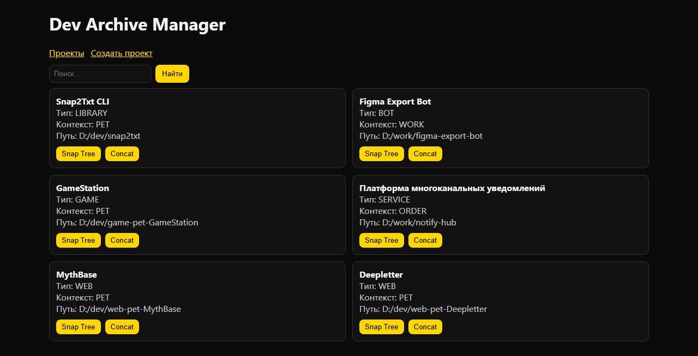
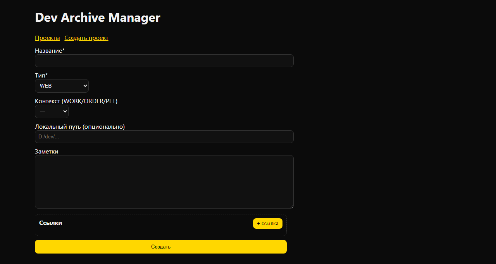

# Dev Archive

Dev Archive — десктопное приложение для ведения личного каталога проектов и связанных с ними материалов. Одна карточка проекта собирает метаданные (тип, контекст, заметки, локальный путь), ссылки на репозитории, документацию, макеты, CI и продакшн-адреса, а также состав проекта по ролям: frontend, backend, mobile, bot, design и DevOps.

Помимо каталога приложение готовит рабочие артефакты по локальным исходникам: строит текстовое дерево каталогов проекта и склеивает его текстовые файлы в один снимок, сохраняя результаты в системном каталоге приложения. Для дизайна оно запрашивает структуру файла Figma и экспортирует выбранные узлы в SVG или PNG. Обработку файлов и данных Figma выполняют два локальных Python-сервиса, к которым обращается API на NestJS; интерфейс собран на Next.js и открывается в оболочке Electron.



## Возможности

- создание карточек проектов с типом, контекстом, заметками и локальным путём;
- хранение ссылок на репозитории, документацию, макеты, CI и продакшн-адреса;
- описание состава проекта по ролям: frontend, backend, mobile, bot, design, DevOps;
- поиск по названию и заметкам;
- построение текстового дерева каталогов проекта;
- склейка текстовых файлов проекта в один снимок с отсевом бинарных и слишком больших файлов;
- хранение сформированных артефактов в системном каталоге приложения;
- получение структуры файла Figma и экспорт выбранных узлов в SVG или PNG.

## Интерфейс

| Список проектов | Новый проект |
| --- | --- |
|  |  |

## Стек

- Electron 31, Next.js 16, React 18, TypeScript;
- NestJS 11, Prisma 5, PostgreSQL 16;
- FastAPI, Uvicorn, Pydantic 2 (Python 3.10+);
- pnpm-воркспейсы, Docker Compose.

## Структура

```text
apps/api-gateway              API на NestJS: проекты, компоненты, ссылки, задачи
apps/desktop                  интерфейс на Next.js и оболочка Electron
workers/py/snap2txt_service   дерево каталогов и склейка файлов проекта
workers/py/figma_parser       структура файла Figma и экспорт узлов в SVG/PNG
docker-compose.yml            PostgreSQL и Redis для локальной разработки
```

## Запуск

Нужны Node.js 20+, pnpm 9+, Python 3.10+ и Docker.

```bash
pnpm install
cp .env.example .env
cp apps/api-gateway/.env.example apps/api-gateway/.env
pip install -r workers/py/snap2txt_service/requirements.txt
pip install -r workers/py/figma_parser/requirements.txt

pnpm dev:infra
pnpm --filter api-gateway prisma:migrate
pnpm dev
```

В отдельном терминале — окно Electron:

```bash
pnpm dev:electron
```

- интерфейс: http://localhost:3000
- API: http://localhost:7780
- snap2txt: http://127.0.0.1:8801
- figma: http://127.0.0.1:8802

Остановить инфраструктуру и удалить данные БД:

```bash
docker compose down -v
```

## Локальная разработка

Сервисы запускаются и по отдельности:

```bash
pnpm dev:api        # API на :7780
pnpm dev:web        # Next.js на :3000
pnpm dev:electron   # окно Electron поверх :3000
pnpm dev:snap       # snap2txt на :8801
pnpm dev:figma      # figma на :8802
```

После изменения схемы Prisma — `pnpm --filter api-gateway prisma:generate`.

Артефакты и служебные файлы проектов приложение хранит вне репозитория:

- Windows — `%APPDATA%\DevArchiveManager\data`
- macOS — `~/Library/Application Support/DevArchiveManager/data`
- Linux — `~/.config/DevArchiveManager/data`

## Конфигурация

| Переменная | Назначение |
| --- | --- |
| `DATABASE_URL` | подключение к PostgreSQL |
| `REDIS_URL` | подключение к Redis |
| `PORT` | порт API-шлюза (по умолчанию 7780) |
| `PY_SNAP_URL` | адрес сервиса snap2txt |
| `PY_FIGMA_URL` | адрес сервиса figma |
| `FIGMA_TOKEN` | токен Figma API для операций с макетами |
| `OPENAI_API_KEY` | ключ OpenAI, зарезервирован для анализа стека |

Полный список — в `.env.example` и `apps/api-gateway/.env.example`.

## API

| Метод | Путь | Назначение |
| --- | --- | --- |
| `POST` | `/projects` | создать проект с компонентами и ссылками |
| `GET` | `/projects` | список проектов, фильтр `?q=` по названию и заметкам |
| `GET` | `/projects/:id` | проект с компонентами, ссылками, задачами и артефактами |
| `PATCH` | `/projects/:id` | обновить поля проекта |
| `POST` | `/projects/:id/scan` | построить текстовое дерево каталогов |
| `POST` | `/projects/:id/concat` | собрать текстовый снимок файлов |

## Команды

```bash
pnpm build                                    # сборка API и интерфейса
pnpm --filter api-gateway prisma:migrate      # применить миграции
pnpm --filter api-gateway prisma:generate     # перегенерировать Prisma Client
```

## Статус

Рабочий прототип: проекты создаются, просматриваются и ищутся; дерево каталогов и текстовый снимок строятся локальными Python-сервисами и сохраняются как артефакты.

Дальше:

- экран подробностей проекта в интерфейсе;
- Figma-операции в desktop UI;
- очередь BullMQ и события прогресса задач;
- стабильная схема миграций и автоматические тесты;
- упаковка Electron-приложения и пользовательская документация.
